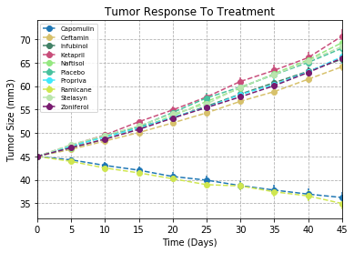
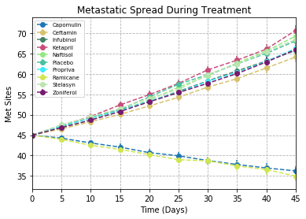
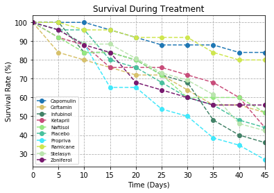
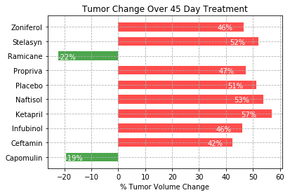

We analyze the performance of several cancer drugs on mice. We analyze how well the drugs treat the cancer as well as the effect the drugs have on the survival rate of the mice.

```python
import numpy as np
import pandas as pd
import matplotlib.pyplot as plt
import random
from scipy.stats import sem
```


```python
clinic_df = pd.read_csv("raw_data/clinicaltrial_data.csv")
mouse_drug_df = pd.read_csv("raw_data/mouse_drug_data.csv")
```


```python
mouse_drug_df.head()
```


<div>
<style>
    .dataframe thead tr:only-child th {
        text-align: right;
    }

    .dataframe thead th {
        text-align: left;
    }

    .dataframe tbody tr th {
        vertical-align: top;
    }
</style>
<table border="1" class="dataframe">
  <thead>
    <tr style="text-align: right;">
      <th></th>
      <th>Mouse ID</th>
      <th>Drug</th>
    </tr>
  </thead>
  <tbody>
    <tr>
      <th>0</th>
      <td>f234</td>
      <td>Stelasyn</td>
    </tr>
    <tr>
      <th>1</th>
      <td>x402</td>
      <td>Stelasyn</td>
    </tr>
    <tr>
      <th>2</th>
      <td>a492</td>
      <td>Stelasyn</td>
    </tr>
    <tr>
      <th>3</th>
      <td>w540</td>
      <td>Stelasyn</td>
    </tr>
    <tr>
      <th>4</th>
      <td>v764</td>
      <td>Stelasyn</td>
    </tr>
  </tbody>
</table>
</div>


```python
clinic_df.head()
```


<div>
<style>
    .dataframe thead tr:only-child th {
        text-align: right;
    }

    .dataframe thead th {
        text-align: left;
    }

    .dataframe tbody tr th {
        vertical-align: top;
    }
</style>
<table border="1" class="dataframe">
  <thead>
    <tr style="text-align: right;">
      <th></th>
      <th>Mouse ID</th>
      <th>Timepoint</th>
      <th>Tumor Volume (mm3)</th>
      <th>Metastatic Sites</th>
    </tr>
  </thead>
  <tbody>
    <tr>
      <th>0</th>
      <td>b128</td>
      <td>0</td>
      <td>45.0</td>
      <td>0</td>
    </tr>
    <tr>
      <th>1</th>
      <td>f932</td>
      <td>0</td>
      <td>45.0</td>
      <td>0</td>
    </tr>
    <tr>
      <th>2</th>
      <td>g107</td>
      <td>0</td>
      <td>45.0</td>
      <td>0</td>
    </tr>
    <tr>
      <th>3</th>
      <td>a457</td>
      <td>0</td>
      <td>45.0</td>
      <td>0</td>
    </tr>
    <tr>
      <th>4</th>
      <td>c819</td>
      <td>0</td>
      <td>45.0</td>
      <td>0</td>
    </tr>
  </tbody>
</table>
</div>


## Tumor Response to Treatment


```python
volume_merge = pd.merge(mouse_drug_df, clinic_df, on = "Mouse ID")[["Drug", "Timepoint", "Tumor Volume (mm3)"]]
group_volume = volume_merge.groupby(["Drug","Timepoint"]).mean().reset_index()
tumor_response = group_volume.pivot(index = 'Timepoint', columns = 'Drug', values = 'Tumor Volume (mm3)')
tumor_response = tumor_response.reset_index()

#Find standard error, make a df, merge with old one. Feels kinda awkward, but I couldn't find a better example.
response_error = volume_merge.groupby(["Drug","Timepoint"]).sem().reset_index()
response_error = response_error.pivot(index = 'Timepoint', columns = 'Drug', values = 'Tumor Volume (mm3)')
response_error = response_error.reset_index()
response_error.columns = ['Timepoint','Capomulin Error','Ceftamin Error','Infubinol Error','Ketapril Error','Naftisol Error',
 'Placebo Error','Propriva Error','Ramicane Error','Stelasyn Error','Zoniferol Error']


response_df = pd.merge(tumor_response, response_error, on = 'Timepoint')

```


```python
response_df = pd.merge(tumor_response, response_error, on = 'Timepoint')

random.seed(0)
#The +10 is hard coding the number of drugs. Could do num_drugs or something for generality, but I already did it.
ax1 = response_df.plot(kind='line', x='Timepoint', y=response_df.columns[1], yerr=response_df.columns[1+10], linestyle='--', marker='o' )
for j in range(2,len(tumor_response.columns)):
    new_color = (random.random(),random.random(),random.random())
    response_df.plot(kind='line', x='Timepoint',color = new_color, y=response_df.columns[j],yerr=response_df.columns[j+10] , linestyle='--',marker='o' ,ax=ax1 )
plt.title("Tumor Response To Treatment")
plt.grid(linestyle = '--')
plt.xlabel("Time (Days)")
plt.ylabel("Tumor Size (mm3)")
#plt.rcParams["figure.figsize"] = (10,10)
plt.legend(loc=2, prop={'size': 7})
plt.show()
```





## Metastatic Response To Treatment


```python
meta_merge = pd.merge(mouse_drug_df, clinic_df, on = "Mouse ID")[["Drug", "Timepoint", "Metastatic Sites"]]
group_meta = meta_merge.groupby(["Drug","Timepoint"]).mean().reset_index()
meta_response = group_meta.pivot(index = 'Timepoint', columns = 'Drug', values = 'Metastatic Sites')
meta_response = meta_response.reset_index()

meta_error = meta_merge.groupby(["Drug","Timepoint"]).sem().reset_index()
meta_error = meta_error.pivot(index = 'Timepoint', columns = 'Drug', values = 'Metastatic Sites')
meta_error = meta_error.reset_index()
meta_error.columns = ['Timepoint','Capomulin Error','Ceftamin Error','Infubinol Error','Ketapril Error','Naftisol Error',
 'Placebo Error','Propriva Error','Ramicane Error','Stelasyn Error','Zoniferol Error']


meta_df = pd.merge(tumor_response, response_error, on = 'Timepoint')
```


```python
random.seed(0)
ax1 = meta_df.plot(kind='line', x='Timepoint', y=meta_df.columns[1],yerr=meta_df.columns[1+10], linestyle='--', marker='o' )
for j in range(2,len(meta_response.columns)):
    new_color = (random.random(),random.random(),random.random())
    meta_df.plot(kind='line', x='Timepoint',color = new_color, y=meta_df.columns[j],yerr=meta_df.columns[1+10], linestyle='--',marker='o' ,ax=ax1 )
plt.title("Metastatic Spread During Treatment")
plt.grid(linestyle = '--')
plt.xlabel("Time (Days)")
plt.ylabel("Met Sites")
plt.legend(loc=2, prop={'size': 7})
plt.show()
```





## Survival Rates


```python
clinic_copy = clinic_df.copy()
clinic_copy['Mouse Count'] = 1

survive_merge = pd.merge(mouse_drug_df, clinic_copy, on = "Mouse ID")[["Drug", "Timepoint", "Mouse Count"]]
group_survive = survive_merge.groupby(["Drug","Timepoint"]).count().reset_index()
survive_response = group_survive.pivot(index = 'Timepoint', columns = 'Drug', values = 'Mouse Count')
survive_response = survive_response.reset_index()

for i in range(1,len(survive_response.columns)):
    survive_response.iloc[:,i] = 100*survive_response.iloc[:,i]/survive_response.iloc[0,i]
    

```


```python
random.seed(0)
ax1 = survive_response.plot(kind='line', x='Timepoint', y=survive_response.columns[1], linestyle='--', marker='o' )
for j in range(2,len(survive_response.columns)):
    new_color = (random.random(),random.random(),random.random())
    survive_response.plot(kind='line', x='Timepoint',color = new_color, y=survive_response.columns[j], linestyle='--',marker='o' ,ax=ax1 )
plt.title("Survival During Treatment")
plt.grid(linestyle = '--')
plt.xlabel("Time (Days)")
plt.ylabel("Survival Rate (%)")
plt.legend(loc=3, prop={'size': 7})
plt.show()
```





## Summary Bar Plot


```python
drugs = list(tumor_response.columns)[1:]
tumor_diffs = [100*(tumor_response[drug][9] - tumor_response[drug][0])/tumor_response[drug][0] for drug in drugs]
colors = []
for val in tumor_diffs:
    if val >= 0:
        colors.append('r')
    else:
        colors.append('g')

my_plot = plt.barh(range(len(drugs)), tumor_diffs, 0.6, tick_label = drugs, color = colors, alpha = 0.7 )

for bar in my_plot:
    width = bar.get_width()
    plt.text(0.85 * width, bar.get_y(),str(int(width)) + '%' ,ha='center', va='bottom', color = 'w')

plt.grid(linestyle = '--')
plt.xlabel('% Tumor Volume Change')
plt.title('Tumor Change Over 45 Day Treatment')
plt.show()

```





## Observations

 Ramicane and Capomulin are the only two drugs to shrink tumors.
 Ramicane and Capomulin had the lowest spread of metastatic sites.
 Rats on Ramicane and Capomulin had the highest survival rates.

 It seems that Ramicane and Capomulin are the best performing drugs on all metrics considered here.
